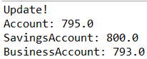
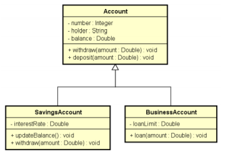

# curso-java-Account

Códigos do curso online de java avançado na Udemy(https://www.udemy.com/share/1013hwA0cfdVlTQn4=/)

->Neste exercicio, foi criado uma classe base (Account) da qual outras duas classes herdam seus atributos e metodos (SavingsAccount e BusinessAccount).

->Foram testados no codigo a palavra instanceof para verificar se o objeto era uma instancia de uma classe especifica, para fazer o downcasting com segurança e fizemos exemplos de upcasting tambem, que sao mais simples, no programa principal.

->Aproveitando o codigo, foi implementada uma redefinicao do metodo da classe base, nas filhas (metodo withdraw), a fim de descontar uma taxa diferenciada para cada tipo de conta. Foi utilizada a palavra @override antes de redefinir o metodo nas classes base e utilizamos o metodo super dentro da classe filha, a fim de que ela repita o mesmo comportamento da mae e depois acrescente sua logica especifica.

Se a descricao nao ficou clara, o programa executa de acordo com o print do console demonstrado a seguir:

As classes foram implementadas seguindo o seguinte diagrama de Classes(Precisa so atualizar a imagem, para acrescentar o metodo withdraw na outra classe filha):

